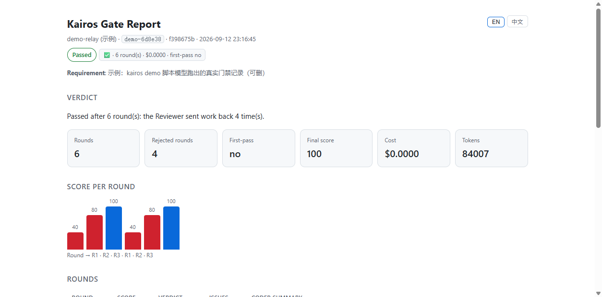
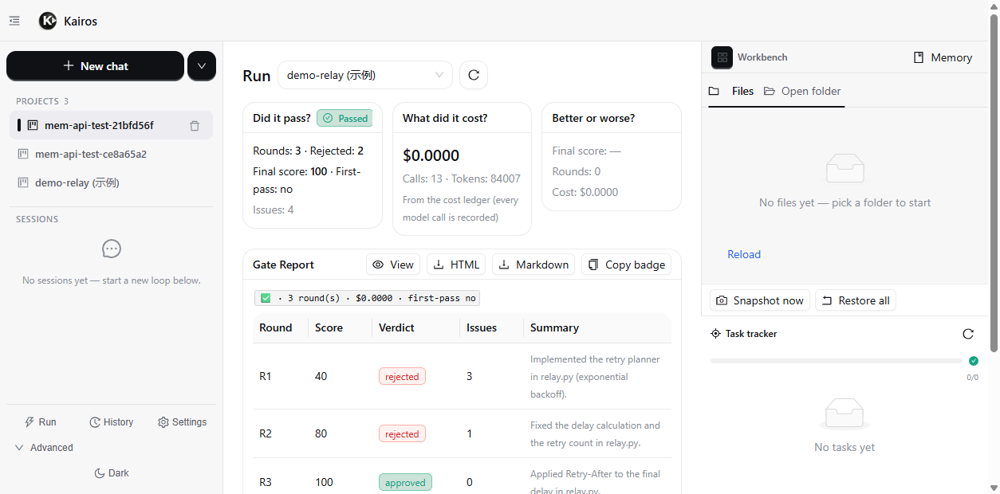
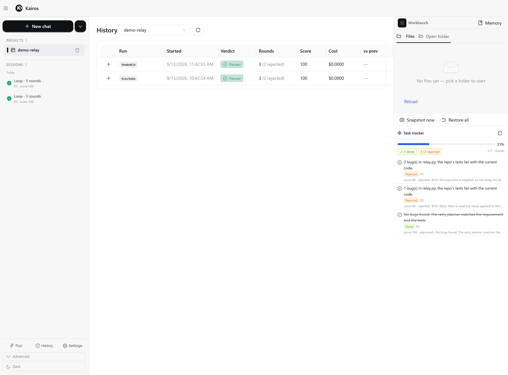

<div align="center">

# Kairos Code

**Self-hosted, model-agnostic multi-agent pipeline with enforced review gates and cost accounting.**

*You don't ship what the agent didn't pass.*

[](https://github.com/Kairos-ai-agent/kairos-code/actions/workflows/ci.yml)
[](LICENSE)
[](https://www.python.org/downloads/)
[](https://nodejs.org)
[](#internationalisation)
[](CONTRIBUTING.md)

</div>

---

A Coder agent writes. A Reviewer agent grades it, round after round, and nothing
is accepted until the Reviewer's verdict passes the gate. Every round, every
token and every dollar is written to a ledger you can audit — and the whole run
exports as a one-file **Gate Report** you can paste into a PR.

Kairos Code is not a chat assistant and not a single-agent coding CLI. It is the
**checkpoint**, the **receipt** and the **invoice** around whichever model you
already pay for.

## 60 seconds, no API key

```bash
pip install -e .
kairos demo
```

```
Kairos demo — the review gate, in about a minute, with no API key.
A scripted model plays the Coder and the Reviewer; the loop, the gate and the ledger are the real thing.
[1/6] building a tiny repo (relay.py + test_relay.py)
[2/6] no API key needed — the real loop meets a scripted model
[3/6] running the loop: Coder → Reviewer → gate
      R1 ✗ rejected · score 40 · 3 bug(s): the exponent is negated, so the delay shrinks with every attempt inste
      R2 ✗ rejected · score 80 · 1 bug(s): Retry-After is read but never applied to the last delay (test_retry_af
      R3 ✓ approved · score 100 · no bugs
[4/6] verifying the final state with the repo's own tests
      3 passed in 0.04s
[5/6] generating the Gate Report
[6/6] done in 7.1s
Badge:  Kairos Gate ✅ · 3 round(s) · $0.0000
```

That is the real loop with a scripted model standing in for the LLM: the same
`loop_runner`, the same gates, the same SQLite round history, the same ledger.
Point it at a real provider and it runs your model — same gate, same scores,
same receipt. The `$0.0000` is honest (no network calls were made).

## Why this exists

| | ChatGPT / Claude | Claude Code / Codex CLI | **Kairos Code** |
|---|---|---|---|
| Unit of work | an answer | a task you supervise | a **gated round** |
| Who judges the result | you | you | a **second agent**, against a score threshold |
| Cost visibility | per chat | per session (if any) | **per round, per run, with alerts** |
| Evidence for "it's done" | you re-read the diff | you re-read the diff | **Gate Report + test output + diff + ledger** |
| Where it runs | vendor cloud | your machine | **your machine, your keys, your models** |

The honest positioning: a frontier coding CLI beats Kairos at raw code quality on
any given attempt. Kairos is about **what you can prove afterwards** — that the
work was reviewed, that it passed a threshold, and what it cost.

## The three things that are actually different

### 1. An enforced gate, not a suggestion

The Reviewer returns a strict verdict and the loop refuses to finish until it
passes. It stops on the first of eight conditions — approval, token cap,
wall-clock cap, infra-failure streak, score stagnation, repeated issue
signature, a hard round cap, or the user pressing stop. See
[Loop stop conditions](#loop-stop-conditions). Implementation:
`kairos/loop/loop_runner.py`.

### 2. A ledger you can invoice from

Every provider call records tokens and cost; the UI shows the per-round curve,
the running total and the cost of each accepted change. `kairos/cost.py` plus
`data/cost.jsonl` are the source of truth, and `kairos/alerts.py` can fire on
budget thresholds.

### 3. An eval harness that re-checks your own pipeline

`kairos/eval.py` records runs, replays them deterministically, and derives eval
cases from real sessions (`scripts/import_session_to_eval.py`), with a
meta-eval over the Reviewer itself. You can measure your pipeline instead of
trusting it.

## The Gate Report

The report is the artifact the pipeline produces: a **single self-contained
HTML file** — no assets, no network — carrying the verdict, the score curve, the
bugs found per round, the test evidence and the ledger. It ships with English
and Chinese inline (the language toggle is client-side, both languages are in
the file), so one file is shareable to a whole team.



```bash
kairos gate report --project <id> --format html   # or md / json
kairos gate report --project <id> --lang zh --out gate.html
```

```http
GET /api/projects/{id}/gate-report?format=html|md|json&lang=en|zh&download=1
```

A badge for your PR description:
`Kairos Gate ✅ · 3 round(s) · $0.0000`

## Install

Four ways in, from "I just want to look at it" to "I want to hack on it".

### 1. Standalone binary — no Python, no Node, nothing to configure

Download the archive for your platform from
[Releases](https://github.com/Kairos-ai-agent/kairos-code/releases), unpack it,
run it:

```bash
./kairos-code                 # starts the server and opens the UI in your browser
./kairos-code --port 9100     # pick a port
./kairos-code --no-browser    # server only
```

State (SQLite, settings, ledger) lives in your per-user application directory.
The macOS build is not code-signed: if Gatekeeper refuses it, clear the
quarantine flag once with `xattr -d com.apple.quarantine kairos-code`.

### 2. Python package

```bash
pip install kairos_code-<version>-py3-none-any.whl   # the wheel from Releases
kairos --version
kairos demo --json --quiet     # the zero-key 60-second run
kairos                         # start the server + the Web UI
```

The wheel ships the built Web UI, so there is nothing to compile. Python 3.11+.
(`pip install kairos-code` once the first PyPI release is out.)

### 3. Docker

From a checkout — nothing has to be published first:

```bash
docker compose up --build      # http://127.0.0.1:8900
```

When a tag is cut, the release workflow builds this same image, smoke-tests it by
running the server and curling `/api/health` and the bundled UI, and pushes it to
ghcr.io, so released tags are also runnable straight from the registry:

```bash
docker run --rm -p 8900:8900 -v "$PWD/data:/data" \
  ghcr.io/kairos-ai-agent/kairos-code:latest
```

State (SQLite, settings, ledger) lives in `./data`, which compose mounts as a
volume. The image binds to loopback by default — see [SECURITY.md](SECURITY.md)
before exposing it.

### 4. From source (recommended while 0.1 is alpha)

```bash
git clone https://github.com/Kairos-ai-agent/kairos-code
cd REPO
python -m venv .venv
. .venv/bin/activate          # Windows: .venv\Scripts\activate
pip install -e ".[dev]"       # drop [dev] for a plain install — either way you
                              # get the `kairos` command on your PATH

# Web UI (optional: the CLI and TUI work without it)
cd web && npm install && npm run build && cd ..

kairos serve --host 127.0.0.1 --port 8900
```

Open http://127.0.0.1:8900 — the API serves the built UI, `/docs` has the
interactive API reference.

### Updating

The packaged app checks GitHub for a newer release — a read-only lookup, cached
for 12 hours, switched off entirely with `KAIROS_NO_UPDATE_CHECK=1` (or
`"updates": {"check": false}` in `settings.json`). When one exists, a banner
appears: **Update now** downloads the asset, verifies the SHA-256 that the same
CI run published in `SHA256SUMS`, and hands the swap to a small helper that
replaces the binary after you quit and starts it again.

Self-replacement only happens where it can: the standalone binary on Windows and
Linux, in a writable directory, when the release publishes a checksum. A release
without one is never executed — the banner becomes a pointer to the release page
instead. On macOS, and for package/source installs, it only notifies:

```bash
# wheel / pipx
pipx upgrade kairos-code      # or: pip install -U kairos-code
# source checkout
git pull && pip install -e ".[dev]"
# docker
docker compose pull && docker compose up -d
```

Nothing is downloaded on startup, ever; the check is one cached lookup and the
download only happens when you click.

### Optional extras

Every one of these is imported lazily: the base install works without them.

```bash
pip install -e ".[tui]"        # kairos tui      (Textual terminal UI)
pip install -e ".[metrics]"    # /metrics        (Prometheus)
pip install -e ".[mcp]"        # MCP stdio client + bundled filesystem server
pip install -e ".[voice]"      # speech in/out   (edge-tts, faster-whisper, pyttsx3)
pip install -e ".[memory]"     # cognee / graphiti memory backends
pip install -e ".[browser]"    # playwright      (real-browser tools)
pip install -e ".[cloud]"      # boto3           (S3-backed artifacts)
pip install -e ".[llm]"        # litellm         (extra model providers)
pip install -e ".[telemetry]"  # opentelemetry   (traces and metrics)
pip install -e ".[daemon]"     # psutil          (kairos daemon)
pip install -e ".[all]"        # everything
```

## Three surfaces, one engine



- **Web UI** — three views by default: **Run** (did it pass? what did it cost?
  better or worse than last round?), **History** (every run: verdict, rounds,
  score, cost, Δ), **Settings**. Everything else (chat, tools, loop internals,
  trace, kanban) is parked under a collapsed *Advanced* group.
- **CLI** — `kairos serve`, `kairos exec`, `kairos gate report`, `kairos demo`.
- **TUI** — `kairos tui` (Textual), for when you live in a terminal.
- **API** — REST + WebSocket; the UI is just a client. See the [API table](#api).

History lists one row per run, with the delta against the run before it:



## Features

**The loop**
- Coder ↔ Reviewer auto-loop with weighted scoring and gate-based termination
- Plan mode — the first round is prose-only; you approve before any edit
- Cross-loop memory — previous rounds persist in SQLite and are summarised into
  the next loop on that project
- Git checkpoint per approved round, with rollback from the UI
- Best-of-N — N parallel Coder attempts per round, highest score wins (opt-in)
- Specialist reviewers — security / perf / design / test sub-scores (opt-in)
- Ask-human gate — the Reviewer can pause and ask a question

**Models**
- Per-role routing: bind any model profile to the Coder or the Reviewer
- 8 direct providers (OpenAI, Anthropic, DeepSeek, Gemini, OpenRouter, Ollama,
  DashScope, ZhipuAI) plus LiteLLM for 100+ more, plus any OpenAI-compatible
  endpoint
- A deterministic **scripted provider** for offline demos and tests
  (`kairos/llm/scripted.py`)

**Operations**
- Cost accounting per call/round/run with budget alerts
- Eval harness: record / replay / derive / meta-eval
- OpenTelemetry and Langfuse hooks, plus a built-in Trace view
- Hooks: `data/hooks/*.py` intercept `pre_tool_use`, `post_tool_use`,
  `loop_round`, `loop_completed`
- MCP stdio client, three-tier skills with FTS5 index and hot reload
- Windows computer-use tools, speech-to-text / text-to-speech, Feishu & Slack
  webhooks
- **63-language UI**, RTL-aware, one locale per language

## Agent roles

Two roles, period. Earlier drafts of this README claimed eight (PM/Architect/QA/
DevOps/…); those were aspirational and never existed. If you want a second
opinion, enable the specialist reviewers — they run alongside the Reviewer and
add weighted sub-scores.

| Role | Job | Default model |
|---|---|---|
| Coder | reads the requirement, plans, edits files, runs tests | OpenAI `gpt-4o` (temp 0.7) |
| Reviewer | reads the diff, runs tests, returns a verdict | Anthropic `claude-sonnet-4` (temp 0.3) |
| Security / Perf / Design / Test reviewers | extra weighted checks (opt-in) | same as Reviewer |

## Architecture

```
kairos/
├── agents/          base.py (tool loop + memory + streaming), roles/{coder,reviewer,…}.py
├── core/            orchestrator.py, message_bus.py, persistence.py (SQLite)
├── llm/             base.py, model_router.py, providers/ (8 + LiteLLM), scripted.py
├── tools/           file_read/write/edit, multi_edit, grep, find, git, terminal (allowlist),
│                    webfetch, websearch, subagent, checkpoint
├── loop/            loop_runner.py — rounds, gates, plan gate, round persistence
├── review/          engine.py (standalone review), comments.py, mermaid.py
├── gate_report.py   the shareable receipt (MD / HTML / JSON, en+zh inline)
├── demo.py          `kairos demo` — the zero-key first run
├── cost.py          the ledger
├── eval.py          record / replay / derive
└── hooks/           hook runner (data/hooks/*.py)
api/                 FastAPI REST + WebSocket, serves the built UI
web/                 React 18 + TypeScript + Ant Design 5 + Vite
tests/               pytest (asyncio_mode = "auto") + vitest on the frontend
```

## Loop stop conditions

Whichever fires first:

1. **Approve gate** — verdict passes: no blocking bugs, score ≥ threshold
2. **Token cap** — cumulative tokens exceed `COST_TOKEN_CAP` (default 500k)
3. **Wall-clock cap** — `COST_TIME_CAP_S` (default 30 min)
4. **Infra-failure streak** — 5 consecutive provider/parse failures
5. **Score stagnation** — last 3 scores within ±2 and below the threshold
6. **No progress** — the same issue signature repeats for 5 rounds
7. **Safety cap** — hard limit at 50 rounds
8. **User stop** — you press stop

Every exit publishes `loop.stopped` with a `reason`, so the UI can explain why
the loop ended — and the reason lands in the Gate Report.

## API

| Endpoint | Method | Description |
|---|---|---|
| `/api/projects` | GET / POST | list / create projects |
| `/api/projects/:id` | GET / DELETE | get / delete |
| `/api/projects/:id/start` · `/stop` | POST | start the loop / stop it |
| `/api/projects/:id/loop` | GET | round, score, issues, history |
| `/api/projects/:id/stats` | GET | score history, tokens, cost, gate firings |
| `/api/projects/:id/diff` · `/checkpoint` | GET / POST | per-round diff · rollback |
| `/api/projects/:id/plan` · `/plan/approve` · `/plan/reject` | GET / POST | plan-mode gate |
| `/api/projects/:id/gate-report` | GET | **the Gate Report** (`format`, `lang`, `download`) |
| `/api/projects/:id/ask` | POST | answer a pending Reviewer question |
| `/api/projects/:id/comments` | GET | inline review comments for editor plugins |
| `/api/projects/:id/attachments` | GET / POST / DELETE | chat attachments |
| `/api/projects/:id/messages` | GET | project-scoped message history |
| `/api/agents` · `/agents/chat` · `/agents/task` | GET / POST | agent states, chat, one-off task |
| `/api/review/project` · `/api/review/file` | POST | one-shot review, no loop |
| `/api/config/models` | GET / POST | model profiles + role mapping |
| `/ws/collaboration` | WS | real-time bus |

## Internationalisation

The UI ships **63 languages** from a single source of truth
(`web/src/i18n/parts/*.json` fragments merged into per-language catalogs), one
locale per language — no `en-GB`/`zh-TW` variants — with RTL layout handled by
logical CSS properties. Adding a language: add it to the generator, run
`python scripts/merge_i18n.py`, translate with
`python scripts/translate_i18n.py --langs <code>`, then let
`node scripts/check_i18n.mjs` prove there is no hardcoded or missing string.
`tests/test_r37_ui_source.py` and the vitest `i18nKeys` gate keep it that way.

## Security

Kairos runs model-generated commands on your machine. Treat it like a shell
with an LLM attached.

- **Loopback by default.** `KAIROS_HOST` defaults to `127.0.0.1`. Binding a
  non-loopback host without `KAIROS_API_TOKEN` logs a warning — don't.
- **Optional API token.** With `KAIROS_API_TOKEN` set, every `/api` route
  except `/api/health`, `/docs`, `/openapi.json`, `/redoc` requires it
  (`Authorization: Bearer …`, `X-API-Token`, or `?token=`).
- **Terminal tool executes argv, not a shell.** Commands are `shlex`-split and
  run through `create_subprocess_exec`, so chaining and redirection are
  impossible. Interpreter/leak-prone heads (`python`, `node`, `env`, `cat`,
  `head`, `tail`, `which`, `where`) are excluded, and package-manager/build
  heads (`npm`, `pnpm`, `yarn`, `go`, `cargo`, `rustc`, `make`, `cmake`) are off
  unless you set `KAIROS_ENABLE_BUILD_COMMANDS=1`.
- **SSRF guards** on `webfetch` and the provider-config endpoints; loopback,
  private, link-local and cloud-metadata targets are refused.
- **Filesystem browsing is rooted** at `KAIROS_FS_ALLOW_ROOTS`.
- **No plaintext key round-trip.** `GET /api/config/settings` returns masked
  keys only; secrets stay in `data/settings.json` (never committed).

See [SECURITY.md](SECURITY.md) for reporting and
[`docs/SANDBOX_ISOLATION.md`](docs/SANDBOX_ISOLATION.md) for the containment
status (Landlock on Linux, Job Objects on Windows) and what is still missing.

## Status

`0.1.0` — alpha. Workable, tested (1800+ Python tests, 120+ frontend tests), and
honest about what is not done: no public benchmark scores (we claim process, not
code quality), a significant mock/offline layer used by the demo, no cloud
parallel sandbox, no IDE plugin beyond `ide/protocol.py`, and no GitHub App that
opens PRs. See [CHANGELOG.md](CHANGELOG.md) for what changed and
`docs/OSS_ADOPTION_ROADMAP.md` for where it is going.

## Contributing

Issues and PRs are welcome — start with [CONTRIBUTING.md](CONTRIBUTING.md) for
the dev setup, the four gates CI enforces, and how to add a language.

```bash
./scripts/ci_local.sh      # exactly what CI runs
```

## License

AGPL-3.0-or-later — see [LICENSE](LICENSE). Copyright (C) 2026 Kairos Code
contributors. You may run, modify and self-host it, including commercially; if you
offer a modified version to users over a network, you must offer them the source.
Vendored third-party components keep their own (permissive) licenses — see
[NOTICE](NOTICE).
