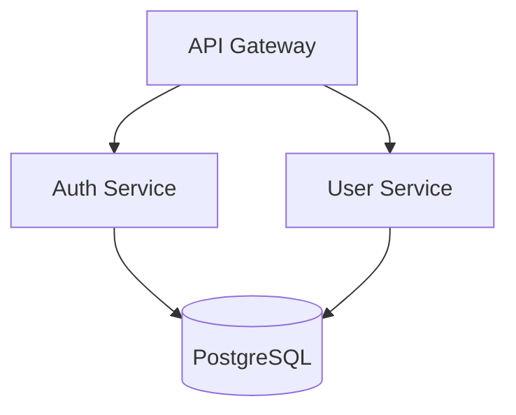

# Senior Architect

Architecture design and analysis tools for making informed technical decisions.

## Tools Overview

### 1. Architecture Diagram Generator

Generates architecture diagrams from project structure in multiple formats.

**Input:** Project directory path
**Output:** Diagram code (Mermaid, PlantUML, or ASCII)

**Supported diagram types:**
- `component` - Shows modules and their relationships
- `layer` - Shows architectural layers (presentation, business, data)
- `deployment` - Shows deployment topology

**Usage:**
```bash
# Mermaid format (default)
python scripts/architecture_diagram_generator.py ./project --format mermaid --type component

# PlantUML format
python scripts/architecture_diagram_generator.py ./project --format plantuml --type layer

# ASCII format (terminal-friendly)
python scripts/architecture_diagram_generator.py ./project --format ascii
```

**Example output (Mermaid):**


### 2. Dependency Analyzer

Analyzes project dependencies for coupling, circular dependencies, and outdated packages.

**Analyzes:**
- Dependency tree (direct and transitive)
- Circular dependencies between modules
- Coupling score (0-100)
- Outdated packages

**Supported package managers:**
- npm/yarn (`package.json`)
- Python (`requirements.txt`, `pyproject.toml`)
- Go (`go.mod`)
- Rust (`Cargo.toml`)

**Usage:**
```bash
python scripts/dependency_analyzer.py ./project
python scripts/dependency_analyzer.py ./project --output json
python scripts/dependency_analyzer.py ./project --check circular
```

### 3. Project Architect

Analyzes project structure and detects architectural patterns, code smells, and improvement opportunities.

**Detects:**
- Architectural patterns (MVC, layered, hexagonal, microservices indicators)
- Code organization issues (god classes, mixed concerns)
- Layer violations
- Missing architectural components

**Usage:**
```bash
python scripts/project_architect.py ./project
python scripts/project_architect.py ./project --verbose
python scripts/project_architect.py ./project --check layers
```

## Decision Workflows

### Database Selection Workflow

Use when choosing a database for a new project or migrating existing data.

| Characteristic | Points to SQL | Points to NoSQL |
|----------------|---------------|-----------------|
| Structured with relationships | ✓ | |
| ACID transactions required | ✓ | |
| Flexible/evolving schema | | ✓ |
| Document-oriented data | | ✓ |
| Time-series data | | ✓ (specialized) |

| Records | Recommendation |
|---------|----------------|
| <1M, single region | PostgreSQL or MySQL |
| 1M-100M, read-heavy | PostgreSQL with read replicas |
| >100M, global distribution | CockroachDB, Spanner, or DynamoDB |
| >10K writes/sec | Cassandra or ScyllaDB |

### Architecture Pattern Selection

| Team Size | Recommended Starting Point |
|-----------|---------------------------|
| 1-3 developers | Modular monolith |
| 4-10 developers | Modular monolith or service-oriented |
| 10+ developers | Consider microservices |

| Requirement | Recommended Pattern |
|-------------|-------------------|
| Rapid MVP development | Modular Monolith |
| Independent team deployment | Microservices |
| Complex domain logic | Domain-Driven Design |
| High read/write ratio difference | CQRS |
| Audit trail required | Event Sourcing |
| Third-party integrations | Hexagonal/Ports & Adapters |

### Monolith vs Microservices Decision

**Choose Monolith when:**
- Team is small (<10 developers)
- Domain boundaries are unclear
- Rapid iteration is priority
- Operational complexity must be minimized
- Shared database is acceptable

**Choose Microservices when:**
- Teams can own services end-to-end
- Independent deployment is critical
- Different scaling requirements per component
- Technology diversity is needed
- Domain boundaries are well understood

**Hybrid approach:** Start with a modular monolith. Extract services only when:
1. A module has significantly different scaling needs
2. A team needs independent deployment
3. Technology constraints require separation

## Tech Stack Coverage

**Languages:** TypeScript, JavaScript, Python, Go, Swift, Kotlin, Rust
**Frontend:** React, Next.js, Vue, Angular, React Native, Flutter
**Backend:** Node.js, Express, FastAPI, Go, GraphQL, REST
**Databases:** PostgreSQL, MySQL, MongoDB, Redis, DynamoDB, Cassandra
**Infrastructure:** Docker, Kubernetes, Terraform, AWS, GCP, Azure
**CI/CD:** GitHub Actions, GitLab CI, CircleCI, Jenkins

## Common Commands

```bash
python scripts/architecture_diagram_generator.py . --format mermaid
python scripts/dependency_analyzer.py . --verbose --check circular
python scripts/project_architect.py . --verbose --check layers
```
